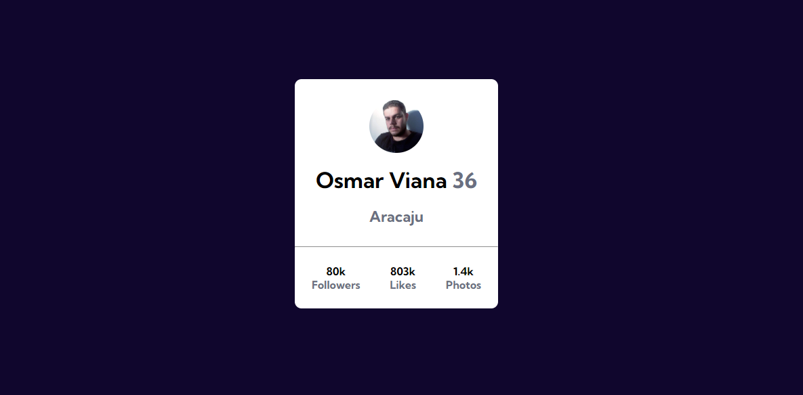
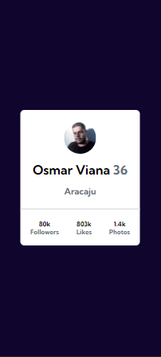

# Projeto Profile Card 👱‍♂️

### Desafio do curso DevQuest onde o principal objetivo é criar um cartão que contenha as informações de perfil. Para ser aprimorado as habilidades de posicionamento de elementos usando flexbox.

### O projeto precisa rodar tanto em desktop como mobile, sem usar media query.
#
## Design Desktop

[]

## Design Mobile

[]

## Tecnologia utilizadas:

- HTML
- CSS